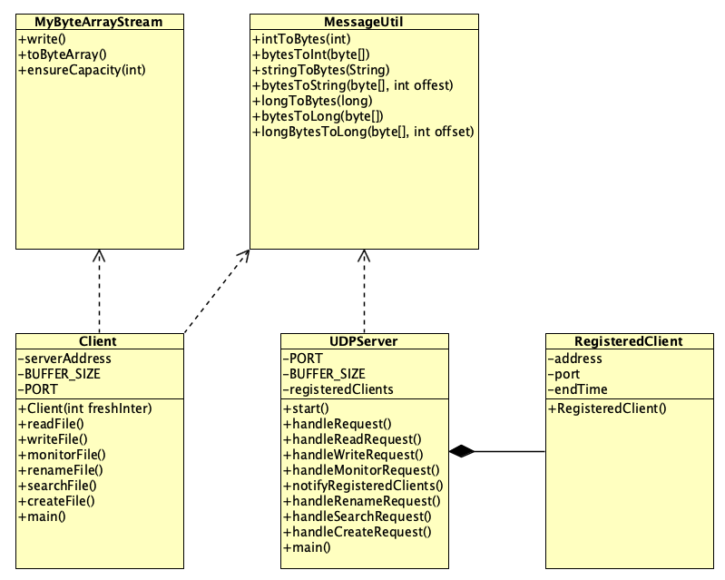

# Course Project Report

The goal of this project is to design and implement a remote file access system based on the Client-Server model.

This report introduces the specific design and implementation of the system by the team members, including but not limited to functional requirements, non-functional requirements and optimization.

## Team Member

Java Part：Xue Yuhan, Zhou Huayu

Go Part：Zhu Haihui, Zhang Zhihang

## 1. Java Part

### 1.0 Work

Zhou Huayu: Responsible for the design and implementation of: system structure, interfaces, remote file reading/writing/renaming/monitoring functions, message structure, and custom bitstream.

Xue Yuhan: Responsible for the design and implementation of: client Cache, remote file query and creation functions.

### 1.1 Architecture Design



### 1.2 Message Structure

Since all messages transferred between server and client are in the form of sequences of bytes, integer values, strings, etc. must be marshalled before transmission. As the length of the string (e.g. file pathname, content to be inserted into the file) is not fixed and may vary from request to request, I transmit the length of each part as a prefix in my implementation so that the system receiving the message can know exactly how to decode the message.

The following is the specific design of the message structure:

1. **Message type and integer value**: Use 4 bytes for transmission.
2. **String**: First transmit a 4-byte integer, indicating the length of the string, and then transmit the bytes of the string.
3. Request format:
   - 4 bytes: Indicates the length of the command (READ/WRITE/MONITOR, etc.).
   - n bytes: command content.
   - 4 bytes: file path length.
   - n bytes: file path content.
   - For READ requests:
     - 4 bytes: offset.
     - 4 bytes: byteCount.
   - For WRITE requests:
     - 4 bytes: offset.
     - 4 bytes: the length of byteSequence.
     - n bytes: byteSequence content.
   - .......

In order to implement such a message structure design, I created a tool class MessageUtil to help marshal and unmarshal messages.

#### 1.2.1 MessageUtil

```java
...
public class MessageUtil {
    //What is encapsulated here is a custom message structure
    public static byte[] intToBytes(int value) {
        return;
    }
    public static int bytesToInt(byte[] bytes) {
        return;
    }

    public static byte[] stringToBytes(String str) {
        byte[] stringBytes = str.getBytes();
        byte[] lengthBytes = intToBytes(stringBytes.length);
        byte[] result = new byte[lengthBytes.length + stringBytes.length];
        System.arraycopy(lengthBytes, 0, result, 0, lengthBytes.length);
        System.arraycopy(stringBytes, 0, result, lengthBytes.length, stringBytes.length);
        return result;
    }

    public static String bytesToString(byte[] bytes, int offset) {
        return;
    }
    public static byte[] longToBytes(long value) {
        return;
    }
    public static long bytesToLong(byte[] bytes) {
        return;
    }
    public static long longByteToLong(byte[] bytes, int offset) {
        return;
    }
    // Add more methods if needed
}
```

The above is the structure of the tool class MessageUtil for marshalling and unmarshalling messages, which implements the marshalling and unmarshalling of byte streams into int, long, and String types. The most critical one is the `stringToBytes` method.

Since the length of the string is not fixed, when the client packages the request, the length of the string needs to be added in front of the string. In the `stringToBytes` method, I reserve 4 bytes of space for the length of the string and put the length information into the byte array, followed by the string that needs to be marshalled.

In actual use, the client needs to use `MessageUtil` to marshal and package all messages in the instantiated object of `ByteArraySteam` before sending a request.

```java
...//The client marshals the message before sending the request
	MyByteArrayStream requestStream = new MyByteArrayStream();
  requestStream.write(MessageUtil.stringToBytes("READ"));
  requestStream.write(MessageUtil.stringToBytes(filePath));
...
```

After the server receives the request, it also uses MessageUtil to unmarshal it. It should be noted that the server must know the design details of the message structure. For example, the first 4 bytes of a string type message are its length, so that the offset can be used correctly. Quantity to parse received messages

```java
...//After receiving the message, the server unassembles the message
	int offset = 0;
	String command = MessageUtil.bytesToString(request, offset);
	offset += 4 + command.length();//Need to skip the 4-byte length information stored in front of the string
	String filePath = MessageUtil.bytesToString(request, offset);
	offset += 4 + filePath.length();
...
```

### 1.3 Byte Stream

Since the project requires that any existing input/output stream classes in Java cannot be used, that is to say, Java's original `ByteArrayOutputStream` cannot be used, so in order to put the grouped messages into the byte stream in order, I imitated Java's The `ByteArrayOutputStream` class implements a simple replacement: the `MyByteArrayStream` class

#### 1.3.1 MyByteArrayStream

The following is a simple `MyByteArrayStream` class that implements similar functionality to `ByteArrayOutputStream`:

```java
public class MyByteArrayStream {
    private byte[] buffer;
    private int size = 0;
    private static final int DEFAULT_SIZE = 32;

    public MyByteArrayStream() {
        buffer = new byte[DEFAULT_SIZE];
    }

    public synchronized void write(byte[] b) {
        ensureCapacity(size + b.length);
        System.arraycopy(b, 0, buffer, size, b.length);
        size += b.length;
    }

    public synchronized byte[] toByteArray() {
        byte[] result = new byte[size];
        System.arraycopy(buffer, 0, result, 0, size);
        return result;
    }

    private void ensureCapacity(int minCapacity) {
        if (minCapacity > buffer.length) {
            int newCapacity = buffer.length << 1;
            if (newCapacity < minCapacity) {newCapacity = minCapacity;}
            byte[] newBuffer = new byte[newCapacity];
            System.arraycopy(buffer, 0, newBuffer, 0, size);
            buffer = newBuffer;
        }
    }
}
```

In order to simulate the behavior of `ByteArrayOutputStream`, the custom class requires a dynamically growing byte array. This is accomplished with an internal array and a pointer to the current location. Whenever you need to add new data you can check if there is enough space and increase the size of the array if not.

In this way, the assembled message can be packaged into a byte stream in the client and sent to the server via UDP:

```java
...//Using custom ByteArrayOutputStream class
	MyByteArrayStream requestStream = new MyByteArrayStream();
	requestStream.write(MessageUtil.stringToBytes("READ"));
	requestStream.write(MessageUtil.stringToBytes(filePath));
	...
	byte[] sendBuffer = requestStream.toByteArray();
	DatagramPacket sendPacket = new DatagramPacket(sendBuffer, sendBuffer.length, serverAddress, PORT);
...
```

### 1.4 客户端的功能实现

#### 1.4.1 指令的处理

项目要求客户端提供一个界面，反复要求用户输入请求，并将请求发送到服务器。服务器返回的回复都会被打印在该界面上。由于不要求实现图形界面，所以我设计了一个简单的控制台交互界面，效果如下：


实现思路则是通过简单的while循环以及if else语句实现交互：

```java
 while (true) {
            System.out.println("Choose operation (READ/WRITE/MONITOR/RENAME/SEARCH/EXIT):");
            String operation = scanner.nextLine().toUpperCase();
            if ("EXIT".equals(operation)) {
                System.out.println("Exiting program...");
                break;
            }
            if ("READ".equals(operation)) {
                System.out.println("Enter file path: /remoteFile/"+"  "+"You don't have to enter '/' at the beginning.");
                String filePath = rootPath+scanner.nextLine();
                System.out.println("Enter offset:");
                int offset = scanner.nextInt();
                System.out.println("Enter byte count:");
                int byteCount = scanner.nextInt();
                scanner.nextLine(); // Consume newline
                String response = client.readFile(filePath, offset, byteCount);
                System.out.println(response);
            }else if ("WRITE".equals(operation)) {
              ...
            } else if ("MONITOR".equals(operation)) {
                ...
            } ...
              else {
                System.out.println("Invalid operation. Please choose the right operation.");
            }
        }
```

#### 1.4.2 远程文件的读写

#### 1.4.3 远程文件的监控

#### 1.4.4 Cache的实现

#### 1.4.5 其他

### 1.5 服务器的功能实现

#### 1.5.1 文件读写

#### 1.5.2 文件的监控

#### 1.5.3 其他

## 2. Go Part

### 2.0 Work

Zhu Haihui:

Zhang Zhihang: