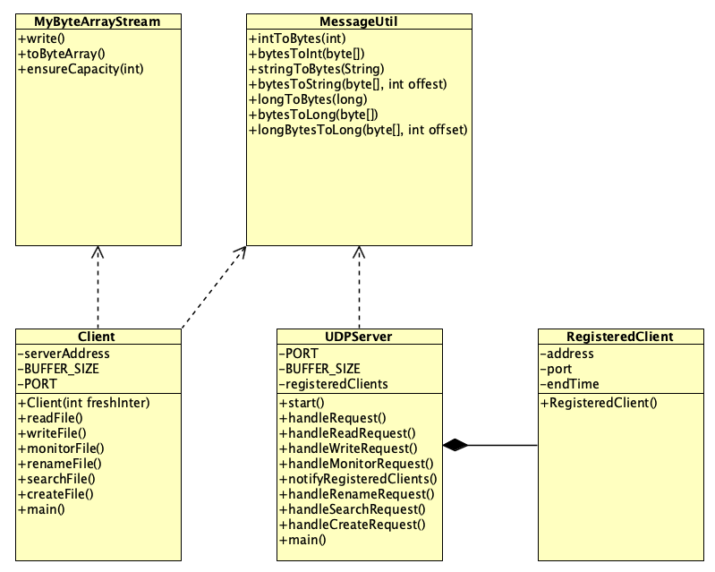
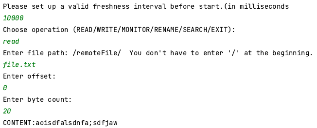
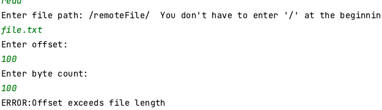

# Course Project Report

The goal of this project is to design and implement a remote file access system based on the Client-Server model.

This report introduces the specific design and implementation of the system by the team members, including but not limited to functional requirements, non-functional requirements and optimization.

We were divided into two groups and implemented server and client functions using two different languages: Java and Go respectively.

## Team Member

Java Part：Xue Yuhan, Zhou Huayu

Go Part：Zhu Haihui, Zhang Zhihang

## 1. Java Part

### 1.0 Contribution

Zhou Huayu: Responsible for the design and implementation of: system structure, interfaces, remote file reading/writing/renaming/monitoring functions, message structure, and customed bitstream.

Xue Yuhan: Responsible for the design and implementation of: client cache, remote file search and creation functions.

### 1.1 Architecture Design



### 1.2 Message Structure

Since all messages transferred between server and client are in the form of sequences of bytes, integer values, strings, etc. must be marshalled before transmission. As the length of the string (e.g. file pathname, content to be inserted into the file) is not fixed and may vary from request to request, I transmit the length of each part as a prefix in my implementation so that the system receiving the message can know exactly how to decode the message.

The following is the specific design of the message structure:

1. **Message type and integer value**: Use 4 bytes for transmission.
2. **String**: First transmit a 4-byte integer, indicating the length of the string, and then transmit the bytes of the string.
3. Request format:
   - 4 bytes: Indicates the length of the command (READ/WRITE/MONITOR, etc.).
   - n bytes: command content.
   - 4 bytes: file path length.
   - n bytes: file path content.
   - For READ requests:
     - 4 bytes: offset.
     - 4 bytes: byteCount.
   - For WRITE requests:
     - 4 bytes: offset.
     - 4 bytes: the length of byteSequence.
     - n bytes: byteSequence content.
   - .......

In order to implement such a message structure design, I created a tool class MessageUtil to help marshal and unmarshal messages.

#### 1.2.1 MessageUtil

```java
...
public class MessageUtil {
    //What is encapsulated here is a custom message structure
    public static byte[] intToBytes(int value) {
        return;
    }
    public static int bytesToInt(byte[] bytes) {
        return;
    }

    public static byte[] stringToBytes(String str) {
        byte[] stringBytes = str.getBytes();
        byte[] lengthBytes = intToBytes(stringBytes.length);
        byte[] result = new byte[lengthBytes.length + stringBytes.length];
        System.arraycopy(lengthBytes, 0, result, 0, lengthBytes.length);
        System.arraycopy(stringBytes, 0, result, lengthBytes.length, stringBytes.length);
        return result;
    }

    public static String bytesToString(byte[] bytes, int offset) {
        return;
    }
    public static byte[] longToBytes(long value) {
        return;
    }
    public static long bytesToLong(byte[] bytes) {
        return;
    }
    public static long longByteToLong(byte[] bytes, int offset) {
        return;
    }
    // Add more methods if needed
}
```

The above is the structure of the tool class MessageUtil for marshalling and unmarshalling messages, which implements the marshalling and unmarshalling of byte streams into int, long, and String types. The most critical one is the `stringToBytes` method.

Since the length of the string is not fixed, when the client packages the request, the length of the string needs to be added in front of the string. In the `stringToBytes` method, I reserve 4 bytes of space for the length of the string and put the length information into the byte array, followed by the string that needs to be marshalled.

In actual use, the client needs to use `MessageUtil` to marshal and package all messages in the instantiated object of `ByteArraySteam` before sending a request.

```java
...//The client marshals the message before sending the request
	MyByteArrayStream requestStream = new MyByteArrayStream();
  requestStream.write(MessageUtil.stringToBytes("READ"));
  requestStream.write(MessageUtil.stringToBytes(filePath));
...
```

After the server receives the request, it also uses MessageUtil to unmarshal it. It should be noted that the server must know the design details of the message structure. For example, the first 4 bytes of a string type message are its length, so that the offset can be used correctly. Quantity to parse received messages

```java
...//After receiving the message, the server unassembles the message
	int offset = 0;
	String command = MessageUtil.bytesToString(request, offset);
	offset += 4 + command.length();//Need to skip the 4-byte length information stored in front of the string
	String filePath = MessageUtil.bytesToString(request, offset);
	offset += 4 + filePath.length();
...
```

### 1.3 Byte Stream

Since the project requires that any existing input/output stream classes in Java cannot be used, that is to say, Java's original `ByteArrayOutputStream` cannot be used, so in order to put the grouped messages into the byte stream in order, I imitated Java's The `ByteArrayOutputStream` class implements a simple replacement: the `MyByteArrayStream` class

#### 1.3.1 MyByteArrayStream

The following is a simple `MyByteArrayStream` class that implements similar functionality to `ByteArrayOutputStream`:

```java
public class MyByteArrayStream {
    private byte[] buffer;
    private int size = 0;
    private static final int DEFAULT_SIZE = 32;

    public MyByteArrayStream() {
        buffer = new byte[DEFAULT_SIZE];
    }

    public synchronized void write(byte[] b) {
        ensureCapacity(size + b.length);
        System.arraycopy(b, 0, buffer, size, b.length);
        size += b.length;
    }

    public synchronized byte[] toByteArray() {
        byte[] result = new byte[size];
        System.arraycopy(buffer, 0, result, 0, size);
        return result;
    }

    private void ensureCapacity(int minCapacity) {
        if (minCapacity > buffer.length) {
            int newCapacity = buffer.length << 1;
            if (newCapacity < minCapacity) {newCapacity = minCapacity;}
            byte[] newBuffer = new byte[newCapacity];
            System.arraycopy(buffer, 0, newBuffer, 0, size);
            buffer = newBuffer;
        }
    }
}
```

In order to simulate the behavior of `ByteArrayOutputStream`, the custom class requires a dynamically growing byte array. This is accomplished with an internal array and a pointer to the current location. Whenever you need to add new data you can check if there is enough space and increase the size of the array if not.

In this way, the assembled message can be packaged into a byte stream in the client and sent to the server via UDP:

```java
...//Using custom ByteArrayOutputStream class
	MyByteArrayStream requestStream = new MyByteArrayStream();
	requestStream.write(MessageUtil.stringToBytes("READ"));
	requestStream.write(MessageUtil.stringToBytes(filePath));
	...
	byte[] sendBuffer = requestStream.toByteArray();
	DatagramPacket sendPacket = new DatagramPacket(sendBuffer, sendBuffer.length, serverAddress, PORT);
...
```

### 1.4 Client Function Implementation

#### 1.4.1 Processing of instructions

The project requires the client to provide an interface that repeatedly asks the user to enter a request and sends the request to the server. The responses returned by the server will be printed on this interface. Since there is no requirement to implement a graphical interface, I designed a simple console interactive interface with the following effect:





The implementation idea is to achieve interaction through a simple while loop and if else statement:

```java
 while (true) {
            System.out.println("Choose operation (READ/WRITE/MONITOR/RENAME/SEARCH/EXIT):");
            String operation = scanner.nextLine().toUpperCase();
            if ("EXIT".equals(operation)) {
                System.out.println("Exiting program...");
                break;
            }
            if ("READ".equals(operation)) {
                System.out.println("Enter file path: /remoteFile/"+"  "+"You don't have to enter '/' at the beginning.");
                String filePath = rootPath+scanner.nextLine();
                System.out.println("Enter offset:");
                int offset = scanner.nextInt();
                System.out.println("Enter byte count:");
                int byteCount = scanner.nextInt();
                scanner.nextLine(); // Consume newline
                String response = client.readFile(filePath, offset, byteCount);
                System.out.println(response);
            }else if ("WRITE".equals(operation)) {
              ...
            } else if ("MONITOR".equals(operation)) {
                ...
            } ...
              else {
                System.out.println("Invalid operation. Please choose the right operation.");
            }
        }
```

#### 1.4.2 Reading, writing and monitoring of remote files

On the client side, the implementation of the read and write functions is relatively simple.

For read operations, you only need to assemble and package the command, file path, offset and character length to be read in a byte stream and send it to the server. After receiving the message from the server, unmarshal it and print the reply on the console.

For write operations, you only need to replace the read length with the written character content, and the rest is the same as the read operation.

For file monitoring operations, the information that needs to be grouped becomes the command, file path, and monitoring duration. Others are the same as for read and write operations.

#### 1.4.3 Cache implementation

The project requires that the system should implement client caching, that is, the file content read by the client is retained in the buffer of the client program. Caching is used to speed up read operations. If the file content requested by the client exists in the cache, the client can read the cached content directly without contacting the server. In addition, freshness interval *t* is specified as a parameter in the command to start the client. After the time interval t, the information in the cache will be determined to be outdated, and a read request will be re-initiated to the server to update the contents in the cache.

In order to implement a cache that meets the requirements, I first declared two variables in the client code, which are used to save cache information and the storage time of each information in the cache.

```java
  private Map<String, Map<Integer, String>> cache = new ConcurrentHashMap<>();
	private Map<String, Long> cacheTimestamps = new ConcurrentHashMap<>();
```

Then I modified the basic file reading method to check whether there is corresponding content in the cache before sending a request to the server.

The specific design is as follows: first find the cacheMap containing the offset information containing the required file through the file path, then check the timestamp of the cache of the required file, compare it with the current system time, if the time difference is greater than the setting when starting the client Freshness Interval, the content in the cache will not be read, but the original basic reading method will be performed to re-obtain new content from the server; if the time difference is less than the Freshness Interval, check the offset and byteCount to confirm whether the content to be read is Within the range of the content saved in the cache, if it is within the range, the information is read from the cache and printed on the console. If it is not within the range, the information is read remotely from the server.

```java
public String readFile(String filePath, int offset, int byteCount) throws IOException {
        Map<Integer, String> offsetCache = cache.get(filePath);
        Long lastUpdatedTimestamp = cacheTimestamps.get(filePath);
        if (lastUpdatedTimestamp != null && (System.currentTimeMillis() - lastUpdatedTimestamp) <= FRESHNESS_INTERVAL && offsetCache != null) {
            for (Map.Entry<Integer, String> entry : offsetCache.entrySet()) {
                int startOffset = entry.getKey();
                String cachedContent = entry.getValue();
                if (offset >= startOffset && offset + byteCount <= startOffset + cachedContent.length()) {
                    System.out.print("Reading from cache: ");
                    return cachedContent.substring(offset - startOffset, offset - startOffset + byteCount);
                }
            }
        }
        ...
    }
```

#### 1.4.4 Other functions

In addition to the above functions, the system also implements an idempotent operation and a non-idempotent operation, which are file search and file renaming respectively.

Remote file search:

```java
public String searchFile(String fileName)throws IOException {
        MyByteArrayStream requestStream = new MyByteArrayStream();
        requestStream.write(MessageUtil.stringToBytes("SEARCH"));
        requestStream.write(MessageUtil.stringToBytes(fileName));
        byte[] sendBuffer = requestStream.toByteArray();
        DatagramPacket sendPacket = new DatagramPacket(sendBuffer, sendBuffer.length, serverAddress, PORT);
        socket.send(sendPacket);
        byte[] receiveBuffer = new byte[BUFFER_SIZE];
        DatagramPacket receivePacket = new DatagramPacket(receiveBuffer, receiveBuffer.length);
        socket.receive(receivePacket);
        String response = new String(receivePacket.getData(), 0, receivePacket.getLength());
        return response;
    }
```

This code implements a simple file search function based on UDP protocol. By sending a request containing the file name to the specified server address and port, and then waiting for and receiving a response from the server. The specific process is as follows:

1. Create a request
2. Send the request: Convert the request string into a byte array and send it to the specified server address and port through a DatagramPacket object.

3. Receive response: Create a new DatagramPacket object to receive the server's response.
4. Parse the response: extract the data from the received packet, convert it to a string, and return this string as the response.

The design and principle of remote file renaming are similar to the search function.

### 1.5 Server Function Implementation

#### 1.5.1 File reading and writing

Reading of files is achieved through a `handleReadRequest` method. After receiving a request in the form of a byte stream from the client, the first thing to do is to parse the request. According to the previously defined message structure, the command, file path, offset and number of characters in the message are parsed in sequence. Pay attention to exception handling when processing various types of data.

After the request is parsed, I read the file through the RandomAccessFile class, read the content at the specified position and length according to the offset and number of characters required by the client, and return it to the client. If the content requested by the client is in the file range or the file does not exist, an error message will be returned.

```java
 private String handleReadRequest(byte[] request){
        int offset = 0;
        String command = MessageUtil.bytesToString(request, offset);
        offset += 4 + command.length();
        String filePath = MessageUtil.bytesToString(request, offset);
        offset += 4 + filePath.length();
        int requestOffset = MessageUtil.bytesToInt(Arrays.copyOfRange(request, offset, offset + 4));
        offset += 4;
        int byteCount = MessageUtil.bytesToInt(Arrays.copyOfRange(request, offset, offset + 4));
        try {
        } catch (NumberFormatException e) {
            return "ERROR:Invalid offset or byte count";
        }
        try (RandomAccessFile file = new RandomAccessFile(filePath, "r")) {//Read operation
            if (requestOffset >= file.length()) {return "ERROR:Offset exceeds file length";}
            byte[] buffer = new byte[byteCount];
            file.seek(requestOffset);
            int bytesRead = file.read(buffer, 0, byteCount);
            return "CONTENT:" + new String(buffer, 0, bytesRead);
        } catch (FileNotFoundException e) {
            return "ERROR:File not found";
        } catch (IOException e) {
            return "ERROR:" + e.getMessage();
        }
    }
```

The request parsing part of the write operation is similar to the read operation. During the writing process, in order to insert into the position specified by the offset, the content after the offset needs to be stored in an array `restOfFile`. After the writing is completed, Finally, write the original follow-up content after the new content.

```java
... 
	if (requestOffset > file.length()) {
		return "ERROR:Offset exceeds file length";
 }
	byte[] restOfFile = new byte[(int) (file.length() - requestOffset)];
  file.seek(requestOffset);
  file.readFully(restOfFile);
  file.seek(requestOffset);
  file.write(byteSequence.getBytes());
  file.write(restOfFile);
  notifyRegisteredClients(filePath, byteSequence);
  return "SUCCESS:Content written successfully";
 ...
```

#### 1.5.2 File monitoring

The function of file monitoring is relatively complex. In addition to parsing the request, the system also needs to save a Map<filePath, ArrayList<>> and maintain a monitoring list for each file. The monitoring list contains the client objects that are monitoring the file. The client object needs to contain the IP address, port, monitoring end time and other member variables. For this purpose, I implemented an inner class `registeredClients`.

```java
 private Map<String, List<RegisteredClient>> registeredClients = new HashMap<>();

 private static class RegisteredClient {
     InetAddress address;
     int port;
     long endTime;
     RegisteredClient(InetAddress address, int port, long interval) {
         this.address = address;
         this.port = port;
         this.endTime = System.currentTimeMillis() + interval;
     }
 }
```

First check whether there is monitoring information for the file in registeredClients. If not, create new monitoring information for the file. Then, create a RegisteredClient object based on the client information monitoring the file, and add the object to the client list in the monitoring information of the file. The client list here is implemented using ArrayList, which can grow dynamically without considering capacity issues.

If a client initiates new monitoring of a file, this method will put the client into the registeredClients List. After processing the list of clients monitoring the file, I used a Timer class, which can automatically create a new thread to handle the client's monitoring requests without blocking the main thread. When the Timer determines that the monitoring time has expired, it will return a message prompting MONITORING EXPRIED to the client.

```java
private String handleMonitorRequest(byte[] request, InetAddress address, int port) {
        ...
        File file = new File(filePath);
        if (!file.exists()) {
            return "ERROR:File does not exist";
        }
        if (!registeredClients.containsKey(filePath)) {
            registeredClients.put(filePath, new ArrayList<>());
        }
        RegisteredClient newClient = new RegisteredClient(address, port, interval);
        registeredClients.get(filePath).add(newClient);
        // Schedule cleanup task to remove client registration after the interval
        Timer timer = new Timer();
        timer.schedule(new TimerTask() {
            @Override
            public void run() {
                List<RegisteredClient> clients = registeredClients.get(filePath);
                clients.removeIf(client -> {
                    if (client.endTime <= System.currentTimeMillis()) {
                        // Send MONITORING EXPIRED message to client when its monitoring time expires
                        if (client.address.equals(newClient.address) && client.port == newClient.port) {
                            byte[] sendBuffer = "MONITORING EXPIRED".getBytes();
                            DatagramPacket sendPacket = new DatagramPacket(sendBuffer, sendBuffer.length, client.address, client.port);
                            try {
                                socket.send(sendPacket);
                            } catch (IOException e) {
                                e.printStackTrace();
                            }
                        }
                        return true;
                    }
                    return false;
                });
            }
        }, interval);
        return "SUCCESS:Monitoring started for " + filePath + " for " + interval + " milliseconds";
    }
```

This method of processing file monitoring will be called after each write operation and rename operation. If the file being modified is in the monitored state (the RegisteredClient List of the file is not empty, and the monitoring has not expired), then this method will return the written content to all clients in the monitoring list that are still in the monitoring state.

```java
private void notifyRegisteredClients(String monitoredFilePath, String content) {
        String filePath=monitoredFilePath;
        List<RegisteredClient> clients = registeredClients.get(filePath);
        if (clients == null) return;

        byte[] sendBuffer = ("UPDATE:" + filePath + ":" + content).getBytes();
        for (RegisteredClient client : clients) {
            if (client.endTime > System.currentTimeMillis()) {
                DatagramPacket sendPacket = new DatagramPacket(sendBuffer, sendBuffer.length, client.address, client.port);
//                System.out.println(sendPacket);
                try {
                    socket.send(sendPacket);
                } catch (IOException e) {
                    e.printStackTrace();
                }
            }
        }
```

#### 1.5.3 Other functions

File renaming requires not only modifying the name of the specified file, but also updating the file list saved in registeredClients, and calling the notifyRegisteredClients method mentioned above to notify the listening client that the file name has been modified.

```java
private String handleRenameRequest(byte[] request) {
        ...
        File oldFile = new File(oldFilePath);
        File newFile = new File(oldFile.getParent(), newFileName);
				...
        if (oldFile.renameTo(newFile)) {
            if (registeredClients.containsKey(oldFilePath)) {
                List<RegisteredClient> clients = registeredClients.remove(oldFilePath);
                registeredClients.put(newFile.getPath(), clients);
                notifyRegisteredClients(newFile.getPath(), "File renamed to: " + newFileName);
            }
            return "SUCCESS:File renamed successfully";
        } else {
            return "ERROR:Failed to rename the file";
        }
    }
```

The file search function only needs to call the getName method of the File class to traverse all files under the comparison path after parsing the request.

```java
	for(File file : files){
		if(file.getName().equals(fileName)){
			return "File found at: "+file.getAbsolutePath();
		}
	}
```

## 2. Go Part

### 2.0 Contribution

Zhu Haihui:

Zhang Zhihang: